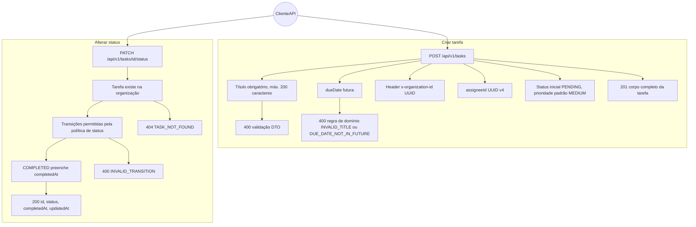
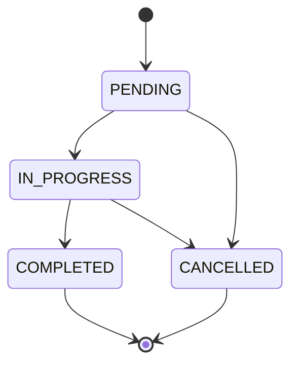
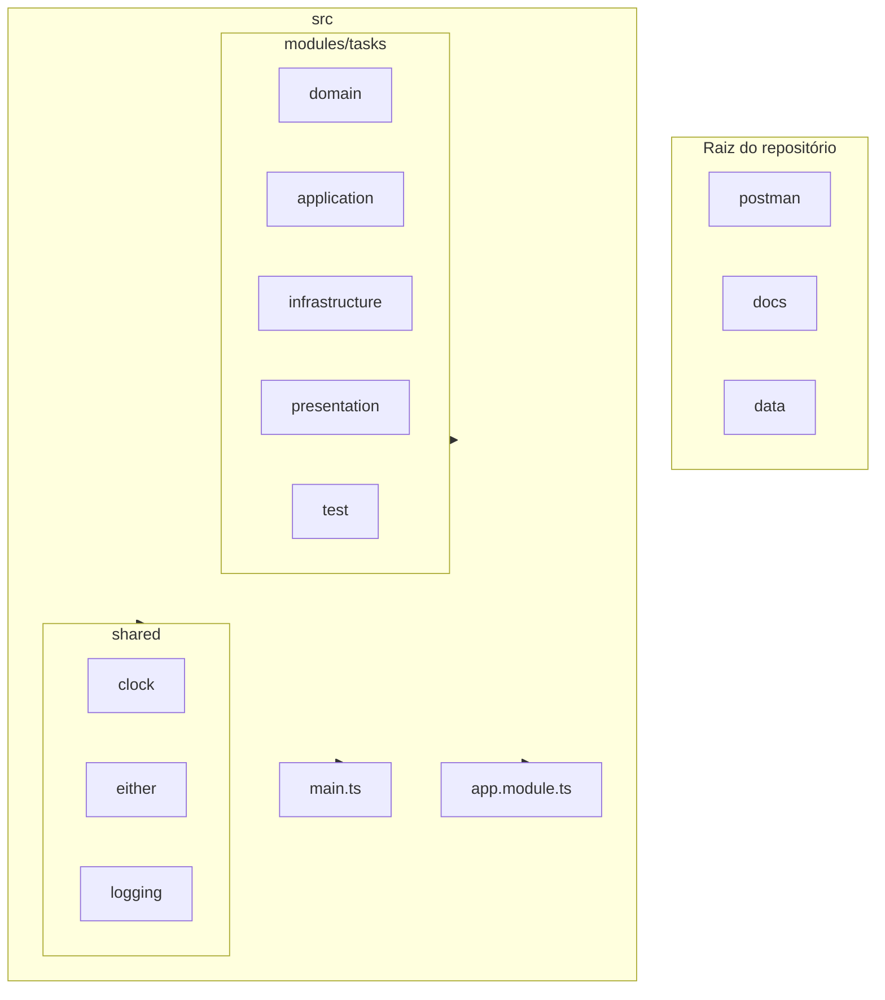
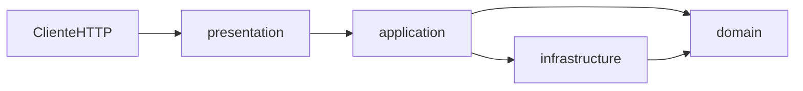
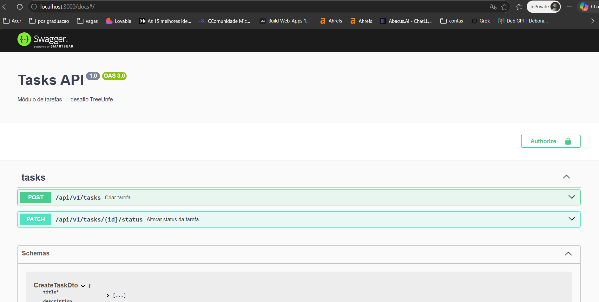
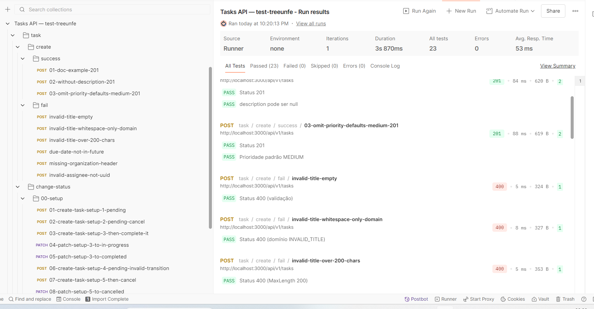

# Módulo Tasks (desafio TreeUnfe)

API **NestJS** com **Clean Architecture** (domínio, aplicação, infraestrutura, apresentação), padrão **Either** para erros de negócio, persistência **SQLite** via **TypeORM** e contexto multi-tenant pelo header **`x-organization-id`**.

Os requisitos funcionais estão descritos em [requisitos.md](requisitos.md).

## Tecnologias

| Área | Tecnologias |
|------|----------------|
| Runtime / framework | Node.js, **NestJS** 11, Express (`@nestjs/platform-express`), **TypeScript** 5 |
| Contrato / documentação | **Swagger / OpenAPI** (`@nestjs/swagger`), UI em `/docs` |
| Persistência | **TypeORM**, **SQLite** (`better-sqlite3`), ficheiro `data/tasks.sqlite` |
| Validação HTTP | `class-validator`, `class-transformer` |
| Testes | **Jest**, `ts-jest`, `@nestjs/testing` |
| Qualidade de código | **ESLint** 10 (flat config, `eslint.config.mjs`), **typescript-eslint**, **Prettier**, `eslint-config-prettier` |
| API manual | Coleção **Postman** em [postman/Tasks-API.postman_collection.json](postman/Tasks-API.postman_collection.json) |

> Este repositório é uma API backend em **NestJS**, não Next.js.

## Casos de uso (cenários de [requisitos.md](requisitos.md))

O diagrama resume o ator **ClienteAPI** (Postman, Swagger UI ou `curl`) e os fluxos principais, incluindo falhas previstas.



### Máquina de estados dos status

Transições alinhadas ao domínio (estados finais não permitem nova mudança).



## Estrutura do projeto

Visão das pastas principais sob `src/` e artefactos na raiz.



`postman/`, `docs/`, `data/` e `src/` são diretórios irmãos na raiz do repositório.

Detalhe do módulo **tasks**:

- **domain** — `entities`, `enums`, `errors`, `types`, `policies`, `factories`
- **application** — `ports`, `use-cases` (create-task, change-task-status)
- **infrastructure** — `persistence` (TypeORM entity, repositório)
- **presentation** — `controllers`, `dto`, `guards`, `decorators`, `mappers`
- **test** — `fixtures`, `helpers` (suporte a testes)

### Fluxo entre camadas



## Pré-requisitos

- Node.js 18 ou superior
- npm

## Instalação e execução

```bash
npm install
npm run start:dev
```

Variáveis de ambiente opcionais:

- **`PORT`** — porta HTTP (predefinição `3000`).
- **`PUBLIC_BASE_URL`** — base usada nas mensagens de log no arranque (predefinição `http://localhost:<PORT>`). Evita ver apenas `http://[::1]:...` no consola.

Após o arranque, o consola mostra por exemplo:

- `Swagger UI: http://localhost:3000/docs`
- `API: http://localhost:3000/api/v1`

**Base URL da API:** `http://localhost:3000/api/v1`  
**Swagger:** `http://localhost:3000/docs`

Em todos os pedidos aos endpoints de tarefas é obrigatório o header **`x-organization-id`** com um **UUID v4** válido (o terceiro grupo deve começar por `4`; o quarto por `8`, `9`, `a` ou `b`).

O ficheiro SQLite é criado em **`data/tasks.sqlite`** (a pasta `data/` é criada ao subir a aplicação).

## Tutorial: Swagger UI

1. Com a API em execução (`npm run start:dev`), abra **`http://localhost:3000/docs`**.
2. Clique em **Authorize** e introduza o valor do **`x-organization-id`** (mesmo UUID que usará nos pedidos).
3. Experimente **POST /api/v1/tasks** e **PATCH /api/v1/tasks/{id}/status** com o corpo indicado nos esquemas.

Captura de exemplo da documentação interativa:



## Tutorial: Postman

1. Em Postman: **Import** → escolha [postman/Tasks-API.postman_collection.json](postman/Tasks-API.postman_collection.json).
2. Na coleção, confirme as variáveis:
   - **`baseUrl`**: `http://localhost:3000`
   - **`organizationId`**, **`assigneeId`**: UUIDs **v4** válidos (ex.: `22222222-2222-4222-8222-222222222222` e `11111111-1111-4111-8111-111111111111`).
3. Estrutura das pastas:
   - **`task/create/success`** e **`task/create/fail`** — cenários de criação.
   - **`task/change-status/00-setup`** — execute **primeiro**, na ordem dos pedidos, para preencher `taskSetup1` … `taskSetup5`.
   - Depois **`task/change-status/success`** e **`task/change-status/fail`**.
4. Use **Collection Runner** na coleção ou numa pasta para correr testes automatizados de uma vez.

Exemplo de execução com todos os testes a passar:



## Modelo de dados (tarefa)

| Campo | Descrição |
|-------|-----------|
| `id` | UUID |
| `title` | String, máx. 200 caracteres |
| `description` | Opcional |
| `status` | `PENDING`, `IN_PROGRESS`, `COMPLETED`, `CANCELLED` |
| `priority` | `LOW`, `MEDIUM`, `HIGH`, `URGENT` |
| `assigneeId` | UUID do responsável |
| `organizationId` | UUID da organização (também enviado via header na criação) |
| `dueDate` | Data de vencimento (deve ser futura na criação) |
| `completedAt` | Preenchido quando o status passa a `COMPLETED` |
| `createdAt` / `updatedAt` | Metadados de auditoria |

### Exemplo: resposta ao alterar status (200)

Inclui `completedAt` (null se o novo status não for `COMPLETED`; caso contrário data de conclusão).

```json
{
  "id": "uuid-da-tarefa",
  "status": "COMPLETED",
  "completedAt": "2026-03-23T15:00:00.000Z",
  "updatedAt": "2026-03-23T15:00:00.000Z"
}
```

## Exemplo com curl (criar tarefa)

```bash
curl -s -X POST http://localhost:3000/api/v1/tasks ^
  -H "Content-Type: application/json" ^
  -H "x-organization-id: 22222222-2222-4222-8222-222222222222" ^
  -d "{\"title\":\"Minha tarefa\",\"assigneeId\":\"11111111-1111-4111-8111-111111111111\",\"dueDate\":\"2027-01-01T00:00:00.000Z\",\"priority\":\"HIGH\"}"
```

No PowerShell, use `` ` `` para continuação de linha ou um único JSON numa linha.

## Comandos de desenvolvimento

| Comando | Descrição |
|---------|-----------|
| `npm run typecheck` | `tsc --noEmit` |
| `npm test` | Testes unitários (Jest) |
| `npm run test:watch` | Jest em modo watch |
| `npm run test:cov` | Cobertura de testes |
| `npm run lint` | ESLint sobre `src/` |
| `npm run lint:fix` | ESLint com correção automática |
| `npm run format` | Prettier — escrever `src/**/*.ts` |
| `npm run format:check` | Prettier — apenas verificação |
| `npm run build` | Compilação Nest (`dist/`) |
| `npm run start` | Arranque sem watch |
| `npm run start:dev` | Arranque com watch |
| `npm run start:prod` | Produção (`node dist/main`) |

## Build de produção

```bash
npm run build
npm run start:prod
```

## Ligações úteis

- [requisitos.md](requisitos.md) — enunciado e regras de negócio
- [docs/](docs/) — imagens de apoio (Swagger, Postman)
- [postman/](postman/) — coleção HTTP
